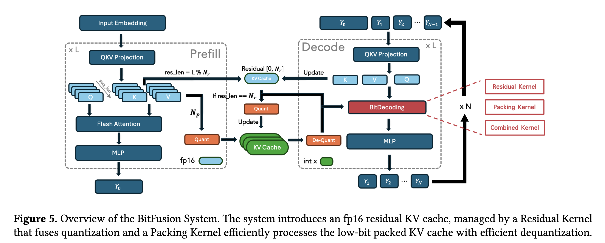
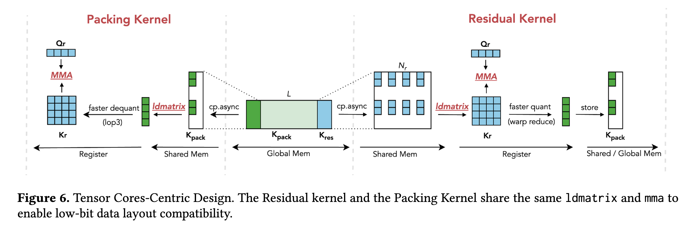
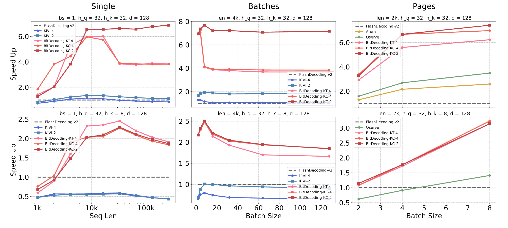
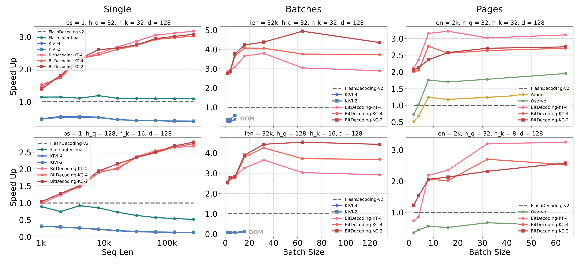

# BitDecoding
[](https://arxiv.org/abs/2503.18773)
[](LICENSE)

BitDecoding is a high-performance, GPU-optimized system
designed to accelerate long-context LLMs decoding with a low-bit KV
cache. Achieve **3-9x speedup** than Flash Attention v2.



## Benchmark
* Kernel Performance in RTX4090

* Kernel Performance in A100


## Installation
```
git clone --recursive https://github.com/DD-DuDa/BitDecoding.git
conda create -n bitdecode python=3.10
conda activate bitdecode
pip install -r requirements.txt
bash install.sh
```

## Quick Start
1. Run the GSM8K example
   ```
   cd evaluation
   bash scripts/example.sh
   ```


## Citation
If you find BitDecoding useful or want to use in your projects, please kindly cite our paper:
```
@INPROCEEDINGS{11408481,
  author={Du, Dayou and Cao, Shijie and Cheng, Jianyi and Mai, Luo and Cao, Ting and Yang, Mao},
  booktitle={2026 IEEE International Symposium on High Performance Computer Architecture (HPCA)}, 
  title={BitDecoding: Unlocking Tensor Cores for Long-Context LLMs with Low-Bit KV Cache}, 
  year={2026},
  volume={},
  number={},
  pages={1-13},
  keywords={Tensors;Quantization (signal);Layout;Graphics processing units;Computer architecture;Throughput;Decoding;Systems support;Kernel;Optimization},
  doi={10.1109/HPCA68181.2026.11408481}}
```

## Acknowledgement
BitDecoding is inspired by many open-source libraries, including (but not limited to) [flash-attention](https://github.com/Dao-AILab/flash-attention/tree/main), [flute](https://github.com/HanGuo97/flute), [Atom](https://github.com/efeslab/Atom), [omniserve](https://github.com/mit-han-lab/omniserve), [KIVI](https://github.com/jy-yuan/KIVI).
